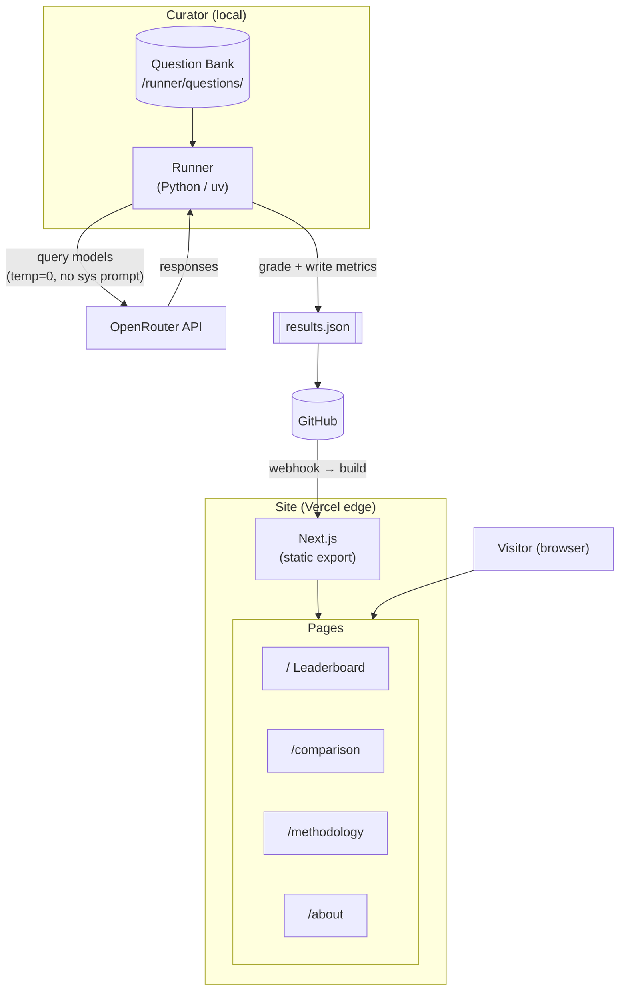

# framebench

A domain specific AI benchmark that evaluates language models on fighting game
(FGC) terminology, frame data, mechanics, domain jargon, and ambiguous concepts.

## Architecture

The question bank is kept private to prevent answer leakage. The site is purely
static, no server runtime, no API calls from the browser. Results are updated by
committing a new `results.json` and letting Vercel redeploy.
